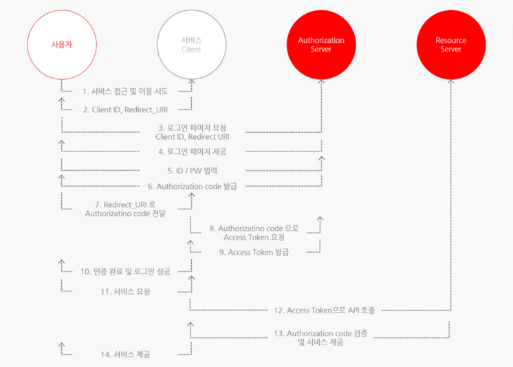
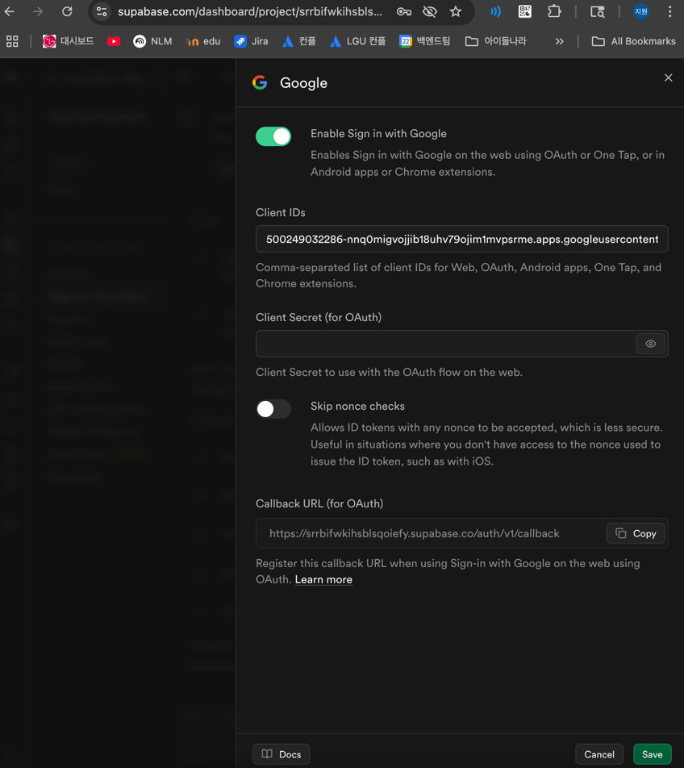

# Supabase OAuth With Google

- [DB 스크립트](../db/1__init.sql) 를 이용해서 supabase 회원 정보 변경이 `user 테이블`에 반영되게 구성되어있습니다.

- Google 계정을 이용한 로그인을 설정하려면,
Supabase의 Callback URL을 복사하여 Google Cloud Console에 등록하고,
생성된 OAuth Client ID를 Supabase에 붙여 넣으면 끝입니다.

## 🤔 OAuth(Open Authorization) 2.0 란?

- OAuth는 사용자가 아이디와 비밀번호를 직접 입력하지 않고,
  제3의 서비스(예: Google)를 통해 안전하게 로그인할 수 있도록 도와주는 인증 방식입니다.
  

- Auth Server 는 로그인을 대신 맡아줄 인증 서버를 의미합니다.
- Resource Server 는 백엔드 서버를 의미합니다. 우리 프로젝트에는 백엔드가 따로 없어서 Google 에서 주는 걸로 사용중이에요.

  ```js
  // 구글이 제공하는 Resource 정보 (OAuth 기본 정보)
  {
    "sub": "1098756...",
    "name": "지원 Kim",
    "email": "jiwon@example.com",
    "picture": "https://lh3.googleusercontent.com/..."
  }
  ```

## 1️⃣ supabase 에서 callback URL 복사

- https://supabase.com/ 접속
- DashBoard > Project > 좌측 Authentication > CONFIGURATION 탭 > Sing IN / Providers
- 하단 Auth Providers 중 Google 활성화
- 화면 하단의 callback URL을 복사해서 구글 콘솔에서 OAuth Client ID를 생성해야합니다.
- 이후 생성한 OAuth Client ID(클라이언트 ID) 와 Client Secret(클라이언트 보안 비밀번호) Supabase에 붙여넣으면 됩니다.
  

## 2️⃣ 구글 콘솔에서 OAuth Client ID 생성

- https://console.cloud.google.com/auth/clients 접속
- Project 생성, `API 및 서비스 > OAUTH`: 앱 이름, 사용자 이메일 등록
- `API 및 서비스 > 사용자 인증정보` 상단 + 만들기 눌러 웹 애플리케이션 추가
- 승인된 리다렉션 URI에 Supabase 에서 복사한 URL 붙여넣고 만들기
- OAuth 클라이언트 생성됨 > 클라이언트 ID 와 Secret 을 복사해서 supabase Google Auth 활성화
  

## 3️⃣ Supabase Google OAuth 코드 구현

- https://supabase.com/docs/guides/auth/social-login/auth-google

### 3.1 로그인/회원가입 페이지에 Google 버튼 추가

- LoginPage.jsx와 SignupPage.jsx 파일에 Google 로그인 기능을 추가합니다:

  ```jsx
  // Google 로그인 함수 추가
  const handleGoogleSignIn = async () => {
    setError("");
    setLoading(true);
  
    const {error} = await supabase.auth.signInWithOAuth({
      provider: 'google',
      options: {
        redirectTo: `${window.location.origin}/auth/callback`,
      }
    });
  
    setLoading(false);
  
    if (error) {
      setError(error.message);
      console.error("Google 로그인 실패", error);
    }
  };
  
  // 폼 하단에 Google 버튼 추가
  <div className="divider">OR</div>
  
  <div className="form-control">
    <button
      type="button"
      className="btn btn-outline"
      onClick={handleGoogleSignIn}
      disabled={loading}
    >
      {loading ? (
        <span className="loading loading-spinner"/>
      ) : (
        <span className="flex items-center justify-center gap-2">
          Google로 로그인
        </span>
      )}
    </button>
  </div>
  ```

#### 3.2 인증 콜백 처리 컴포넌트 생성

- Google 인증 후 리다이렉트를 처리할 AuthCallback 컴포넌트를 생성합니다:

  ```jsx
  // src/components/AuthCallback.jsx
  import {useEffect} from 'react';
  import {supabase} from '../libs/supabase';
  import {useUserStore} from '../stores/userStore';
  import {useNavigate} from 'react-router-dom';
  
  function AuthCallback() {
    const navigate = useNavigate();
    const setUser = useUserStore((state) => state.setUser);
  
    useEffect(() => {
      const handleAuthCallback = async () => {
        const {data: {session}, error} = await supabase.auth.getSession();
  
        if (error) {
          console.error('Error getting session:', error);
          navigate('/login');
          return;
        }
  
        if (session) {
          setUser(session.user);
          navigate('/');
        }
      };
  
      handleAuthCallback();
    }, [navigate, setUser]);
  
    return (
      <div className="flex items-center justify-center min-h-screen bg-base-200">
        <div className="card shadow-xl bg-base-100">
          <div className="card-body">
            <h2 className="card-title">인증 처리 중...</h2>
            <p>잠시만 기다려주세요.</p>
            <div className="flex justify-center mt-4">
              <span className="loading loading-spinner loading-lg"></span>
            </div>
          </div>
        </div>
      </div>
    );
  }
  
  export default AuthCallback;
  ```

#### 3.3 라우터에 콜백 경로 추가

- main.jsx 파일에 인증 콜백 경로를 추가합니다:

  ```jsx
  // AuthCallback 컴포넌트 import
  import AuthCallback from "./components/AuthCallback.jsx";
  
  // 라우터에 경로 추가
  {
    path: "auth/callback", 
    element: <AuthCallback/>
  }
  ```
